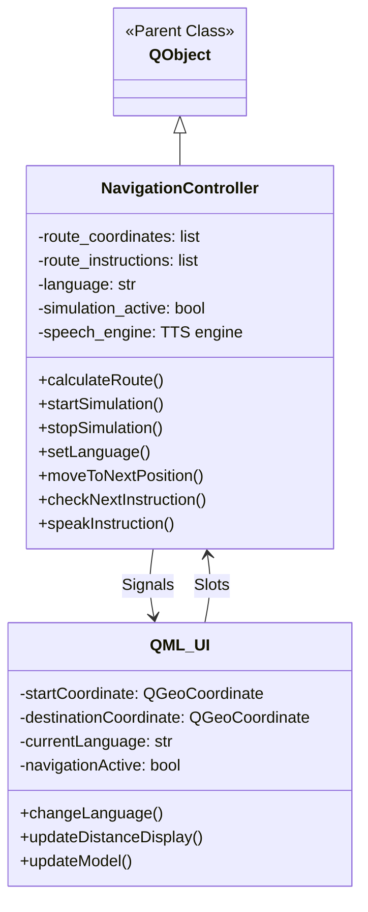
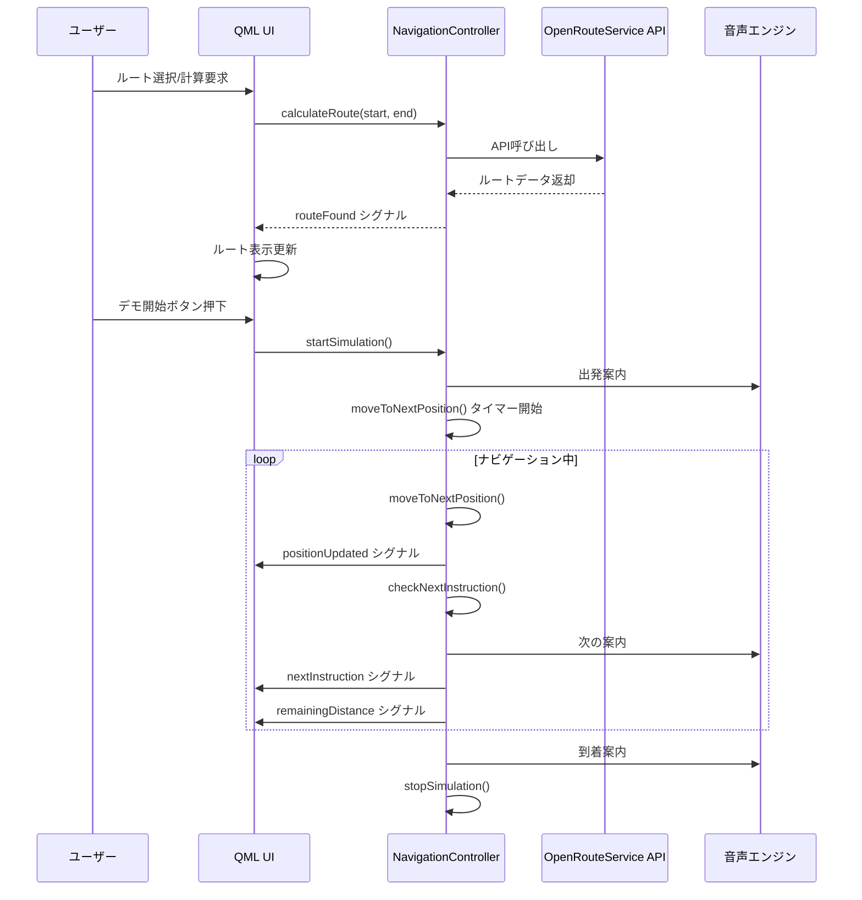
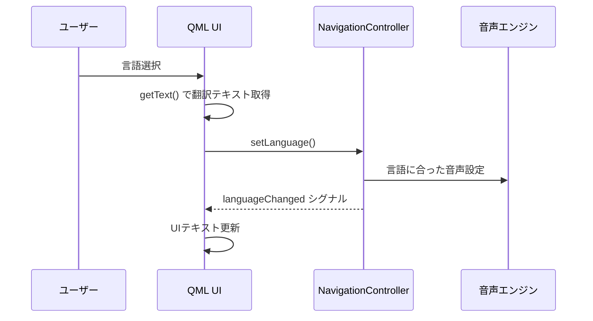

# Qt Navigation App

## 概要

QtNavigation Appは、PyQt5を使用して開発されたオープンソースのナビゲーションアプリケーションです。このアプリケーションは、OpenRouteServiceのAPIを活用して、選択した出発地点から目的地までの最適なルートを計算・表示し、ターンバイターン方式で音声ガイダンスを提供します。

アプリケーションはデスクトップ環境で動作し、カリフォルニア（アメリカ）と日本のプリセットされた場所の間のルート案内をサポートします。また、言語設定を英語と日本語の間で切り替えることが可能です。


## 特徴

- OpenStreetMapを使用した地図表示
- OpenRouteService APIを利用したルート計算
- ターンバイターン音声ガイダンス
- 英語・日本語のマルチ言語対応
- プリセットされた人気のルート選択
- カスタム目的地の設定（地図上の長押し操作）
- リアルタイムの距離表示
- ルート上の分岐点の視覚表示

## システム構成図

```mermaid
graph TD
    User[ユーザー] --> |操作| UI[QML UI]
    UI <--> |データ連携| Controller[NavigationController]
    Controller --> |API呼び出し| ORS[OpenRouteService API]
    ORS --> |ルート情報| Controller
    Controller --> |音声案内| TTS[Text-to-Speech エンジン]
    UI --> |表示| Map[OpenStreetMap]
    Controller --> |更新通知| UI
    
    subgraph QML UI Components
        MapView[地図表示]
        RouteView[ルート表示]
        Controls[コントロールボタン]
        LanguageSelector[言語選択]
        LocationPresets[プリセット位置]
    end
    
    UI --- QML UI Components
```

## アプリケーション構造



## シーケンス図

### ルート計算とナビゲーション開始



### 言語切り替え



## 主要コンポーネント

### NavigationController (Python)

NavigationControllerは、アプリケーションのバックエンドロジックを担当するPythonクラスです。このコントローラは以下の主要な機能を提供します：

- OpenRouteService APIを使用したルート計算
- ナビゲーションシミュレーションの管理
- 現在位置の更新と進捗追跡
- 次の指示のタイミング計算
- 音声ガイダンスの提供
- 多言語サポート

### QML UI

QMLで記述されたユーザーインターフェースは、以下のコンポーネントで構成されています：

- 地図表示（OpenStreetMap）
- 現在位置とルートの視覚表示
- ルート選択ドロップダウン
- ナビゲーションコントロール（開始・停止・リセット）
- 言語選択
- 指示表示と距離表示

## インストールと実行

### 必要条件

- Python 3.7以上
- PyQt5
- pyttsx3（音声合成）
- requests（API通信用）

### インストール

```bash
# 依存関係のインストール
pip install -r requirements.txt
```

### 実行

```bash
python main.py
```

## 主要機能

1. **ルート計算**: OpenRouteService APIを使用して出発地から目的地までの最適ルートを計算
2. **音声ガイダンス**: Text-to-Speech技術を使用した、ターンバイターン方式の音声案内
3. **マルチ言語対応**: 英語と日本語のインターフェースと音声案内
4. **ルートシミュレーション**: リアルタイムのルート移動シミュレーション
5. **プリセットルート**: 頻繁に使用されるルートのプリセット
   - Mountain View → Palo Alto
   - Mountain View → San Jose
   - Mountain View → San Francisco
   - 東京駅 → 東京タワー
   - 渋谷 → 原宿
   - 新宿 → 池袋
6. **カスタム目的地**: 地図上の長押しによる目的地変更
7. **リアルタイム距離表示**: 残りの距離をリアルタイムで表示

## 技術スタック

- **フロントエンド**: QML/Qt Quick
- **バックエンド**: Python/PyQt5
- **地図データ**: OpenStreetMap
- **ルート計算**: OpenRouteService API
- **音声合成**: pyttsx3
- **HTTP通信**: requests

## カスタマイズ

### OpenRouteService APIキー

アプリケーションを利用するには、OpenRouteServiceのAPIキーを取得し、`main.py`ファイル内の`ORS_API_KEY`変数に設定する必要があります：

```python
ORS_API_KEY = "YOUR_OPENROUTESERVICE_API_KEY"
```

### 音声設定

各言語の音声は`setLanguage`メソッド内でカスタマイズできます。例えば英語ではMelina（またはFiona）の音声を優先的に使用しています：

```python
if 'melina' in voice.name.lower():
    print(f"Setting Melina voice: {voice.name} / {voice.id}")
    self.speech_engine.setProperty('voice', voice.id)
```

## ライセンス

このプロジェクトはオープンソースで、[MITライセンス](LICENSE)の下で公開されています。

## 謝辞

- OpenRouteService - ルート計算APIの提供
- OpenStreetMap - 地図データの提供
- PyQt5 - クロスプラットフォームGUIフレームワーク
- pyttsx3 - オープンソース音声合成ライブラリ