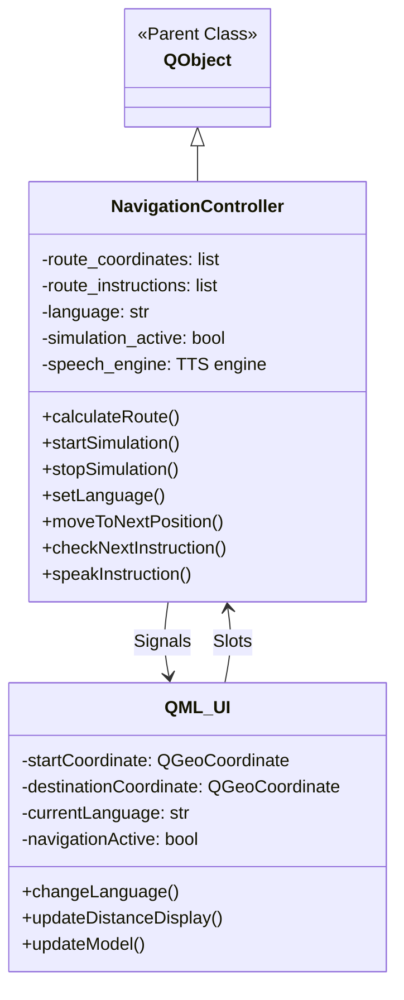
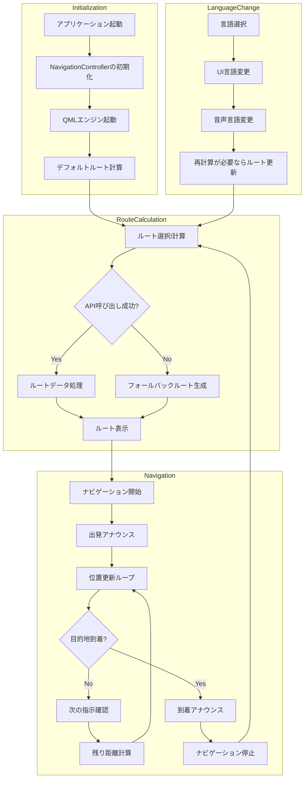
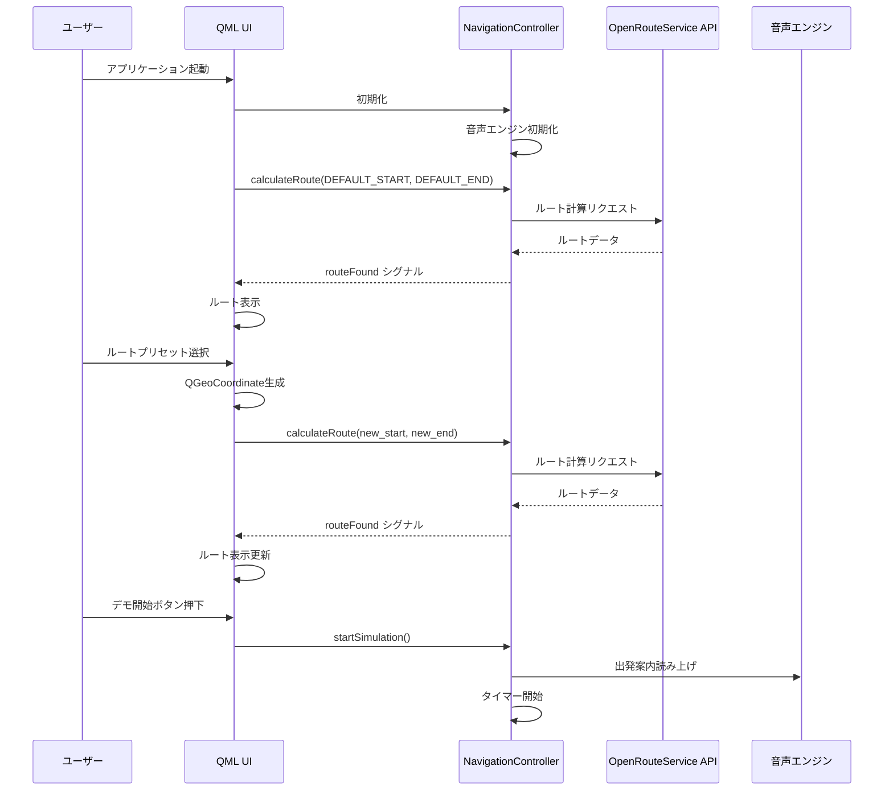
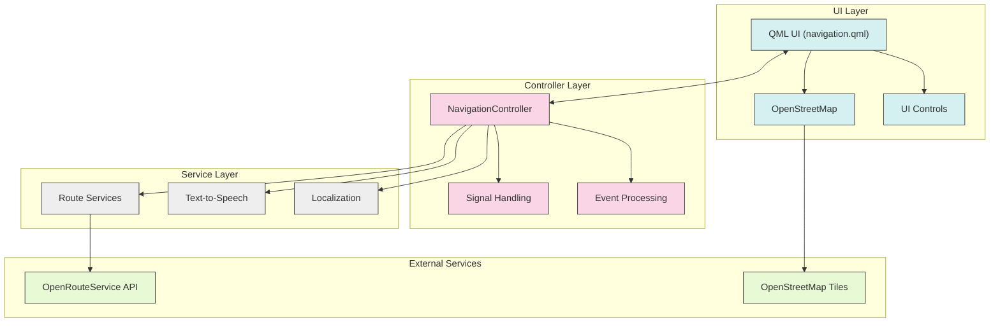

# Qt Navigation App

## 概要

QtNavigation Appは、PyQt5を使用して開発されたオープンソースのナビゲーションアプリケーションです。このアプリケーションは、OpenRouteServiceのAPIを活用して、選択した出発地点から目的地までの最適なルートを計算・表示し、ターンバイターン方式で音声ガイダンスを提供します。

アプリケーションはデスクトップ環境で動作し、カリフォルニア（アメリカ）と日本のプリセットされた場所の間のルート案内をサポートします。また、言語設定を英語と日本語の間で切り替えることが可能です。


## 特徴

- OpenStreetMapを使用した地図表示
- OpenRouteService APIを利用したルート計算
- ターンバイターン音声ガイダンス
- 英語・日本語のマルチ言語対応
- プリセットされた人気のルート選択
- カスタム目的地の設定（地図上の長押し操作）
- リアルタイムの距離表示
- ルート上の分岐点の視覚表示

## システム構成図

```mermaid
graph TD
    User[ユーザー] --> |操作| UI[QML UI]
    UI <--> |データ連携| Controller[NavigationController]
    Controller --> |API呼び出し| ORS[OpenRouteService API]
    ORS --> |ルート情報| Controller
    Controller --> |音声案内| TTS[Text-to-Speech エンジン]
    UI --> |表示| Map[OpenStreetMap]
    Controller --> |更新通知| UI
    
    subgraph QML UI Components
        MapView[地図表示]
        RouteView[ルート表示]
        Controls[コントロールボタン]
        LanguageSelector[言語選択]
        LocationPresets[プリセット位置]
    end
    
    UI --- QML UI Components
```

## アプリケーション構造



## アプリケーションフロー



## シーケンス図



## アーキテクチャ構成



## 主要コンポーネント

### NavigationController (Python)

NavigationControllerは、アプリケーションのバックエンドロジックを担当するPythonクラスです。このコントローラは以下の主要な機能を提供します：

- OpenRouteService APIを使用したルート計算
- ナビゲーションシミュレーションの管理
- 現在位置の更新と進捗追跡
- 次の指示のタイミング計算
- 音声ガイダンスの提供
- 多言語サポート

### QML UI

QMLで記述されたユーザーインターフェースは、以下のコンポーネントで構成されています：

- 地図表示（OpenStreetMap）
- 現在位置とルートの視覚表示
- ルート選択ドロップダウン
- ナビゲーションコントロール（開始・停止・リセット）
- 言語選択
- 指示表示と距離表示

## 機能一覧

### コア機能

| 機能 | 説明 | 主要実装クラス/メソッド | 
|------|------|------------------------|
| ルート計算 | OpenRouteService APIを使用して経路を計算 | `NavigationController.calculateRoute()` |
| 経路案内 | ターンバイターン方式のナビゲーション | `NavigationController.moveToNextPosition(), checkNextInstruction()` |
| 音声ガイダンス | 指示と方向を音声で案内 | `NavigationController.speakInstruction()` |
| マルチ言語対応 | 英語・日本語UIと音声案内 | `NavigationController.setLanguage()`, `QML getText()` |
| 地図表示 | OpenStreetMapを利用した地図表示 | `QML Map` コンポーネント |
| ルートシミュレーション | デモモードでルート上を移動 | `NavigationController.startSimulation()` |

### ユーザーインターフェース機能

| 機能 | 説明 | 主要実装 |
|------|------|---------|
| ルート選択 | プリセットされたルートから選択 | `QML ComboBox` と `updateModel()` |
| 言語切替 | 英語と日本語の切替 | `changeLanguage()` と `languageSelector` |
| 音声切替 | 言語に応じた音声選択 | `setLanguage()` 内の音声選択ロジック |
| 指示表示 | 次の指示をヘッダに表示 | `onNextInstruction()` と `instructionLabel` |
| 距離表示 | 残り距離をリアルタイム表示 | `onRemainingDistance()`, `updateDistanceDisplay()` |
| マーカー表示 | 現在位置とルートのマーカー表示 | `MapQuickItem` と `MapPolyline` |
| デモコントロール | シミュレーション開始/停止 | `startDemo`, `stopDemo` ボタン |
| 地図操作 | 拡大/縮小、移動、目的地変更 | `Map` と `MouseArea` |

## インストールと実行

### 必要条件

- Python 3.7以上
- PyQt5
- pyttsx3（音声合成）
- requests（API通信用）

### インストール

```bash
# 依存関係のインストール
pip install -r requirements.txt
```

### 実行

```bash
python main.py
```

## カスタマイズ

### OpenRouteService APIキー

アプリケーションを利用するには、OpenRouteServiceのAPIキーを取得し、`main.py`ファイル内の`ORS_API_KEY`変数に設定する必要があります：

```python
ORS_API_KEY = "YOUR_OPENROUTESERVICE_API_KEY"
```

### 音声設定

各言語の音声は`setLanguage`メソッド内でカスタマイズできます。例えば英語ではMelina（またはFiona）の音声を優先的に使用しています：

```python
if 'melina' in voice.name.lower():
    print(f"Setting Melina voice: {voice.name} / {voice.id}")
    self.speech_engine.setProperty('voice', voice.id)
```

## ライセンス

このプロジェクトはオープンソースで、[MITライセンス](LICENSE)の下で公開されています。

## 謝辞

- OpenRouteService - ルート計算APIの提供
- OpenStreetMap - 地図データの提供
- PyQt5 - クロスプラットフォームGUIフレームワーク
- pyttsx3 - オープンソース音声合成ライブラリ
